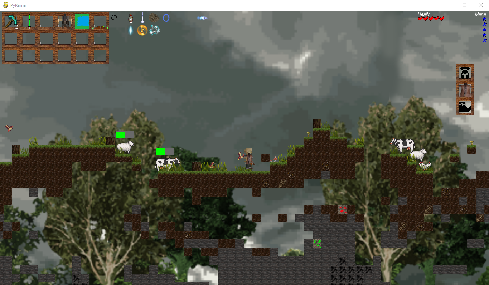

# PyRarria | 2020

## O Projekcie
PyRarria to platformowa gra zręcznościowa z otwartym światem w całości napisana w Pythonie. Zadaniem gracza jest przetrwać zmasowane ataki przeciwników oraz rozwijać swoje uzbrojenie i ekwipunek, eksplorując mapę. Mapa w PyRarrii składa się z dwóch części - części naziemnej, gdzie gracz zdobywa pożywienie i walczy z mobami oraz części podziemnej, gdzie poszukiwać możemy drogocennych kruszców, potrzebnych do wyrabiania bardziej skomplikowanych narzędzi, np. rudy miedzi. Gracz posiada ekwipunek, w którym może gromadzić zbierane przedmioty. Dodatkowo gracz może wyposażyć się w zbroję, miecz oraz łuk. Podczas walki, oprócz standardowej broni gracz może użyć jednego z wielu dostępnych zaklęć.  
  

## Wykorzystane narzędzia
* Python 3
* pygame 2.0.1
